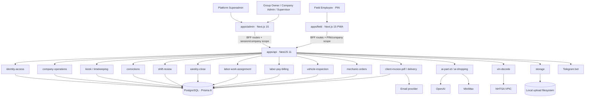
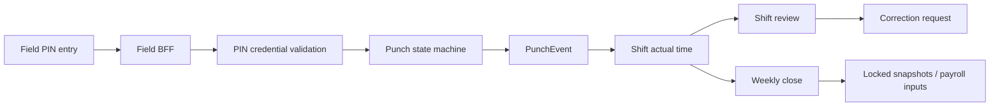
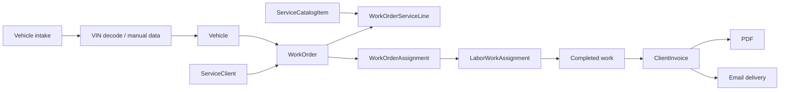
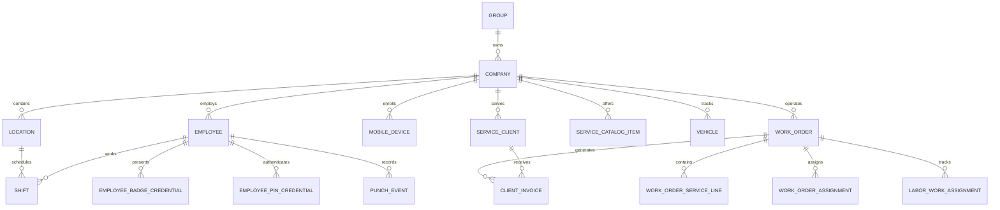

# LaborLedger Code Graph

> Generated from the supplied static analysis, not from a live repository checkout. Verify paths and runtime behavior before changing code. Update this file when boundaries or data flow change.

## System Graph



## Repository Map

```text
laborledger/
├── apps/
│   ├── api/src/modules/
│   │   ├── identity-access/          auth, sessions, invitations, company scope
│   │   ├── company-operations/       employees, vehicles, locations, work orders, scheduling
│   │   ├── kiosk/                    punch state machine
│   │   ├── worker/                   legacy worker endpoints
│   │   ├── field/                    Field bootstrap/site operations
│   │   ├── mobile/                   Android mobile device enrollment, badge+PIN auth, sessions, audit, mobile-only rate limits
│   │   ├── corrections/              correction approval workflow
│   │   ├── shift-review/             shift approval
│   │   ├── weekly-close/             lock/snapshot/close/reopen
│   │   ├── labor-work-assignment/    employee work execution and progress
│   │   ├── labor-pay-billing/        payroll/client labor previews and exports
│   │   ├── vehicle-inspection/       inspection checklists
│   │   ├── vehicle-photos/           vehicle media
│   │   ├── mechanic-orders/          parts and approvals
│   │   ├── client-invoice-pdf/       invoice rendering
│   │   ├── client-invoice-delivery/  invoice email delivery
│   │   ├── storage/                  local file storage
│   │   ├── vin-decode/               NHTSA and provider abstraction/stubs
│   │   ├── ai-part-id/               vision-based part identification
│   │   ├── ai-shopping/              shopping search
│   │   ├── operations-reports/       operational reporting
│   │   └── company-dashboard/        dashboard aggregations
│   ├── admin/src/
│   │   ├── app/(platform)/           platform-level UI
│   │   ├── app/(workspace)/          company workspace UI
│   │   └── app/api/                  Admin BFF
│   ├── field/src/
│   │   ├── app/field/                employee operational screens
│   │   ├── app/api/                  Field BFF
│   │   ├── components/employee/
│   │   ├── components/worker/        legacy components
│   │   └── lib/*-client.ts           Field API clients
│   └── telegram-bot/src/index.ts     bot commands and queries
├── packages/database/prisma/
│   ├── schema.prisma
│   └── migrations/
├── deploy/
└── tests/{api,admin,field}/
```

## Core Flow Graphs

### Timekeeping



Critical invariants: PIN belongs to company; punch transition is valid; repeated requests are idempotent; closed weeks reject unauthorized changes.

### Mobile Boundary (Phase 0A)

```mermaid
flowchart LR
  Admin[Admin BFF/session] --> Tokens[POST /mobile/devices/enrollment-tokens]
  Tokens --> Enroll[POST /mobile/devices/enroll]
  Enroll --> Device[MobileDevice]
  Device --> Login[POST /mobile/auth/login badge+PIN]
  Login --> Session[MobileSession opaque bearer token]
  Session --> Guard[MobileBearerGuard]
  Guard --> MeLogout[/mobile/auth/me + logout]
  Login --> RateLimit[MobileRateLimitService failures only]
  Enroll --> RateLimit
  Tokens --> Audit[MobileAuditService redacted reasons]
  Login --> Audit
```

Mobile routes are server-side NestJS APIs intended to sit behind approved BFF/mobile clients, not Field PWA changes. Enrollment asserts lockout first, records only failed enrollment attempts, clears failures on success, and never stores raw enrollment tokens, Android IDs, badge UIDs, PINs, or bearer tokens in audit output.

### Vehicle to Invoice



Critical invariants: all records share company scope; statuses move through allowed transitions; invoice lines derive from finalized work-order services; money values preserve rounding and currency semantics.

## Data Ownership Graph



## High-Risk Nodes

| Node | Risk | Required handling |
|---|---|---|
| `company-operations.service.ts` | 4,402-line multi-domain service | Characterize, extract one domain, preserve contracts |
| `telegram-bot/src/index.ts` | Reported cross-tenant query risk | Require configured company scope in every query |
| `storage.service.ts` | Capacity, MIME, local-disk failure | Validate before write; test failure paths; back up uploads |
| `vehicle-inspection.service.ts` | Reported wrong employee association | Derive employee from authenticated PIN/session context |
| `labor-pay-billing` | Draft methods incomplete | Do not expose unfinished behavior as production-ready |
| `LaborWorkAssignment` model | Reference/snapshot field complexity | Trace all reads/writes before schema changes |
| Field company resolver | Single-company environment binding | Do not claim multi-tenant Field support until replaced |

## Change Impact Checklist

When changing a node, inspect its neighbors:

- API controller and request validation.
- Role/company/location scope resolution.
- Prisma query filters and transactions.
- Admin/Field BFF route contracts.
- UI loading, empty, success, and error states.
- Integration tests and fixtures.
- Invoice, weekly-close, or audit side effects.
- External provider failure and retry behavior.
