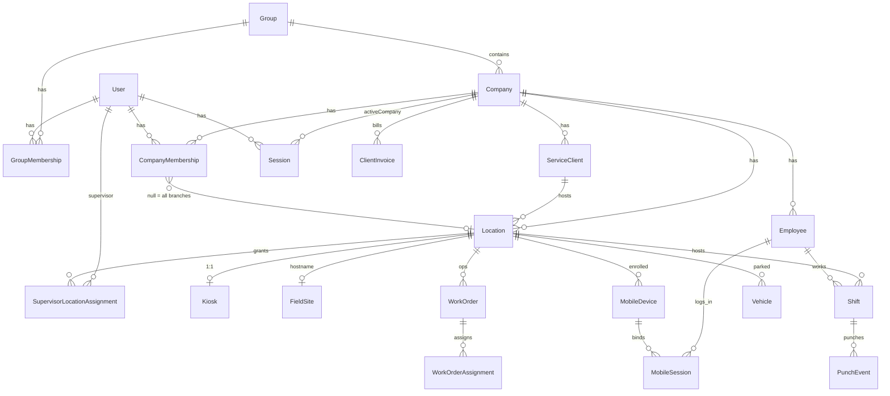
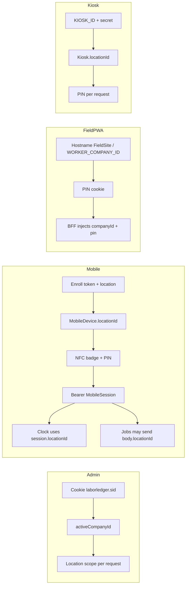

# LaborLedger — Location & Tenant Architecture Review

**Repository:** `/home/ubuntu/apps/laborledger`  
**Date:** 2026-07-29  
**Mode:** Analysis only (no code, schema, DB, PM2, build, or Git changes)  
**Scope:** Multitenant model, locations/branches, auth sessions (admin/mobile/field/kiosk), permissions, operational filtering

---

## A. Resumen ejecutivo

LaborLedger usa una jerarquía real de cuatro niveles:

**Platform → Group → Company → Location**

- **Company** es el tenant de aplicación (aislamiento de datos y configuración).
- **Location** es la sucursal / contexto operativo (turno, kiosk, dispositivo móvil, work order, vehículo).
- No existen modelos Prisma llamados `Tenant`, `Branch`, `Organization`, `Workplace` ni `Permission`. Esos conceptos se implementan con `Company`, `Location`, `Group` y enums de rol.

El login administrativo **no pide ubicación**. Solo pide email/password y, si hace falta, **compañía**. La ubicación en admin se aplica después, por membresía (`CompanyMembership.locationId`) o asignaciones de supervisor (`SupervisorLocationAssignment`), más filtros opcionales en pantallas.

El login móvil **sí congela ubicación**: viene del dispositivo enrolado (`MobileDevice.locationId` → `MobileSession.locationId`). El clock respeta esa ubicación; crear jobs / iniciar labor-work acepta un `locationId` del cliente validado solo a nivel compañía/cliente, no contra el dispositivo.

**Problema principal para la experiencia de ubicación:** no es que el login admin exija ubicación de más; es la **inconsistencia de fuentes de ubicación** entre stacks (sesión admin sin `activeLocationId`, móvil ligado al device, field por bootstrap/hostname, y algunos endpoints que confían en `locationId` del body). Optimizar login no debe debilitar el aislamiento por `companyId`.

**Datos reales (solo lectura, entorno actual):** 1 group, 4 companies, 6 locations activas, 3 users (1 multi-company, 1 single-company, 1 platform superadmin), 0 membresías con scope de una sola location, 1 supervisor con 2 locations, 7 mobile devices activos en 2 locations, 0 registros operativos con `locationId` nulo donde el campo es obligatorio.

---

## B. Arquitectura actual

### B.1 Jerarquía y nomenclatura real

| Concepto de negocio | Nombre real en Prisma / código | Notas |
|---|---|---|
| Organización / cuenta operativa | `Group` | Lifecycle ACTIVE / SUSPENDED / ARCHIVED |
| Tenant | `Company` | Comentarios/servicios lo tratan como tenant |
| Sucursal / branch | `Location` | Comentario en `CompanyMembership.locationId`: “Branch scope” |
| Cliente facturable | `ServiceClient` | Toda `Location` exige `serviceClientId` |
| Terminal Field por hostname | `FieldSite` | 1:1 con location |
| Reloj físico | `Kiosk` | 1:1 con location (legado, no expandir) |
| Dispositivo móvil | `MobileDevice` | Enrolado a company + location |
| Punch | `PunchEvent` | Sin `locationId` directo; vía `Shift` |
| Factura | `ClientInvoice` | Company-scoped; sin `locationId` |
| Permisos granulares | *(no hay modelo)* | Roles + scope de location |

Cadena obligatoria de location:

```text
Group → Company → ServiceClient → Location
```

### B.2 Entidades relevantes

#### `Group` (`groups`)
- **Propósito:** contenedor superior / lifecycle del tenant group.
- **Relaciones:** muchas `Company`, memberships, y denormalización de `groupId` en tablas operativas.
- **Campos company/location:** ninguno hacia arriba.
- **Eliminación:** padre Restrict en hijos.
- **Estado:** activo.

#### `Company` (`companies`)
- **Propósito:** tenant de aplicación; settings JSON; billing profile.
- **Campos:** `groupId` obligatorio; `name` único por group; `settings` JSON.
- **Índices:** `groupId`; unique `(groupId, name)`.
- **onDelete:** `group` Restrict.
- **Estado:** activo (tenant principal).

#### `Location` (`locations`)
- **Propósito:** sucursal operativa (timezone, nombre).
- **Campos:** `groupId`, `companyId`, `serviceClientId` obligatorios; `archivedAt` opcional (soft-delete).
- **Índices:** group/company/serviceClient/archivedAt; unique `(companyId, name)`.
- **onDelete:** Restrict en padres.
- **Estado:** activo. Siempre pertenece a una company.

#### `User` (`users`)
- **Propósito:** identidad global (email/password).
- **Tenancy:** vía memberships; `globalRole` (`NONE` | `PLATFORM_SUPERADMIN`).
- **Sin** `companyId` / `locationId` en el usuario.

#### `Session` (admin cookie)
- **Propósito:** sesión HttpOnly `laborledger.sid`.
- **Tenancy en sesión:** solo `activeCompanyId` opcional.
- **No existe** `activeLocationId`.
- Cookie: token opaco; hash SHA-256 en DB; TTL 7 días.

#### `CompanyMembership`
- **Propósito:** rol de company (`COMPANY_ADMIN` | `SUPERVISOR`) + status + **scope de branch**.
- **`locationId` null** = “all locations” para admin.
- **`locationId` cuid** = scope de una sola sucursal.
- Datos actuales: 5 membresías ACTIVE con all-locations; 0 con single-location.

#### `SupervisorLocationAssignment`
- **Propósito:** grants explícitos location↔supervisor.
- Obligatorios: `groupId`, `companyId`, `locationId`, `supervisorUserId`.
- Soft unassign: `unassignedAt`.
- Datos: 1 supervisor con 2 locations activas.

#### `Employee`
- Company-scoped (`groupId`, `companyId`).
- **Sin `locationId`.** El empleado no tiene ubicación primaria en schema.
- Opera en locations vía shifts / assignments / badges.

#### `MobileDevice` / `MobileSession` / `EmployeeBadgeCredential`
- `locationId` **obligatorio**.
- Sesión móvil denormaliza `groupId`, `companyId`, `locationId`, `deviceId`, `employeeId`.
- Bearer token 12h.

#### `Shift`
- `groupId`, `companyId`, `locationId`, `employeeId`, `serviceClientId` obligatorios.

#### `PunchEvent`
- `groupId`, `companyId` obligatorios; location vía shift.

#### `WorkOrder` / `Vehicle`
- `locationId` obligatorio + company/group/serviceClient.

#### `WorkOrderAssignment`
- Company-scoped; location vía work order.

#### `LaborWorkAssignment`
- `locationId` obligatorio.

#### `ClientInvoice` (+ payments/lines)
- Company-scoped; **sin locationId**.

#### Roles (enums, no Permission table)
- `GlobalRole`, `GroupRole` (`GROUP_OWNER`), `CompanyRole` (`COMPANY_ADMIN`, `SUPERVISOR`).
- Capacidades derivadas en `CompanyScopeService` (`canManageCompany`, `canAccessWeeklyClose`, `canAccessKioskAdmin`).

### B.3 Diagrama Mermaid (modelo real simplificado)



### B.4 Compañía vs ubicación (evidencia)

| Pregunta | Respuesta | Evidencia |
|---|---|---|
| ¿Qué es company? | Tenant de aplicación | `Company` schema L66–133; session `activeCompanyId` |
| ¿Qué es location? | Sucursal / contexto operativo | `Location` L360–400; membership comment L238–239 |
| ¿Location siempre de una company? | Sí | `Location.companyId` required |
| ¿Companies sin location? | Posible en schema; **0** en datos actuales | Query read-only |
| ¿Multi-location por company? | Sí | 1 company con 3 locations en datos |
| ¿Ops siempre con locationId? | Work orders, shifts, vehicles, labor-work, mobile: sí. Invoices, employees, catalog, users: no | Schema |
| ¿Módulos solo companyId? | Facturas, catálogo, settings, empleados, users/memberships | Schema + services |
| ¿Branch separado? | No; location = branch | Naming en membership |
| ¿Duplicados? | `groupId` denormalizado en casi todo; location a veces en session y a veces en body | Patrón intencional de query |

### B.5 Clasificación de módulos por alcance

| Módulo | Alcance |
|---|---|
| Platform customers / groups | Global de plataforma |
| Users / invitations / memberships | Mixto (platform + company) |
| Company settings / billing settings / catalog | Global de compañía |
| Employees / rates | Global de compañía (sin location fija) |
| Clients (`ServiceClient`) | Global de compañía |
| Locations / kiosks / field sites / mobile devices | Específico de ubicación (admin de company) |
| Shifts / schedule / corrections / punch | Específico de ubicación |
| Labor-work | Específico de ubicación (registro) + listados filtrables |
| Jobs / work orders / vehicles / VIN receive | Específico de ubicación |
| Invoices / payments | Global de compañía |
| Reports / dashboard / weekly-close | Mixto (company + filtros location) |
| Audit logs | Mixto (group/company opcionales) |

---

## C. Flujo de login administrativo

### C.1 Paso a paso

1. **UI** `apps/admin/src/app/login/page.tsx` L18–41  
   Envía `{ email, password }` a `POST /api/auth/login`. **Sin company ni location.**

2. **BFF** `apps/admin/src/app/api/auth/login/route.ts`  
   Proxy a API `POST /auth/login`; reenvía `Set-Cookie: laborledger.sid`.

3. **API** `AuthController.login` → `AuthService.login`  
   `apps/api/src/modules/identity-access/auth.service.ts` L34–96  
   - Verifica password  
   - `SessionService.createSession` (token random, hash en DB)  
   - Lista compañías accesibles  
   - Decide `redirectTo`

4. **Cookie** `session-cookie.ts`  
   Nombre: `laborledger.sid`  
   Flags: HttpOnly; Secure (prod); SameSite=Lax; Max-Age=7d  
   Contenido: **solo token opaco** (no JWT, no company embebida).

5. **Identificación de compañía**  
   - Superadmin → `redirectTo = "platform"` (sin auto-select)  
   - 0 companies → `"blocked"`  
   - 1 company → set `activeCompanyId` + `"dashboard"`  
   - 2+ → `"choose-company"` sin `activeCompanyId`

6. **Membresías**  
   Cargadas en middleware `auth-session.middleware.ts` y `CompanyAccessService.buildPrincipalForUser`:  
   group owners + company admin/supervisor ACTIVE.

7. **Selector de workspace**  
   Página `/choose-company` + `ChooseCompanyClient` → `POST /auth/select-company`  
   Actualiza `sessions.activeCompanyId` sin rotar token.

8. **Ubicación en login**  
   **No se elige.** No hay `choose-location`, ni `activeLocationId`, ni “última ubicación” en sesión.

9. **Entrada al workspace**  
   `loadWorkspaceContext()` (`workspace-auth.ts` L59–105):  
   - Cookie requerida  
   - `GET /auth/me`  
   - Si `requiresCompanySelection` → redirect choose-company  
   - `selectedCompany = activeCompany ?? accessibleCompanies[0]`  
   - Redirect post-login “dashboard” apunta a `/employees` (`auth-utils.resolveLoginRedirectPath`)

10. **Cambio posterior**  
    `AdminSessionBar` L28–49: Switch company / Choose company; `router.refresh()`.  
    **No hay switch de ubicación de sesión.** Los listados usan query filters (`?locationId=`) validados por `assertLocationFilterAllowed`.

### C.2 Qué contiene realmente la sesión

**Cookie:** token.

**DB Session:** `userId`, `tokenHash`, `activeCompanyId?`, `expiresAt`, `revokedAt?`.

**AuthenticatedPrincipal** (`auth.types.ts` L3–12):

```text
userId
email
globalRole
groupOwnerGroupIds
companyAdminCompanyIds
supervisorCompanyIds
sessionId
activeCompanyId
```

**No contiene:** `locationId`, `employeeId`, `deviceId`, `roles[]` detallados, `permissions[]`, `allowedLocationIds` (estos últimos se calculan por request en `CompanyScopeService`).

### C.3 ¿El login exige información resoluble automáticamente?

- **Company:** ya se auto-selecciona si hay exactamente una. Multi-company requiere elección (correcto).
- **Location:** **no se pide hoy en admin login.** Cualquier fricción de ubicación viene de filtros UI / formularios operativos / mobile enroll, no del login admin.
- **Mejora real de login admin:** recordar última `activeCompanyId` válida para multi-company (hoy multi-company siempre pasa por choose-company si no hay active).

---

## D. Flujo móvil

### D.1 Tres stacks paralelos



### D.2 Mobile auth (NFC + device)

1. Admin crea enrollment token con `companyId` + `locationId` (`mobile-device.service.ts`).
2. App `POST /mobile/devices/enroll` → `MobileDevice` ligado a esa location.
3. Admin registra badge NFC con `locationId` (y opcional `deviceId`).
4. `POST /mobile/auth/login` con `{ deviceId, badgeUid, pin }` (`mobile-auth.service.ts` L43–113):
   - Device ACTIVE
   - Badge en **mismo company + location del device**
   - PIN del employee
   - Sesión con `locationId = device.locationId`
5. `GET /mobile/auth/me` con Bearer → revalida device en company+location de sesión.
6. Context (`mobile-contracts.ts`):

```text
sessionId, groupId, companyId, locationId, deviceId, employeeId, expiresAt
```

### D.3 Cómo se determina la ubicación móvil

| Operación | Fuente de location |
|---|---|
| Sesión / clock | Dispositivo enrolado |
| Gate de badge | Badge debe coincidir con location del device |
| Job options | Todas las locations activas de la company |
| Create job / labor-work start | **Body del cliente**, validado vs company/serviceClient, **no vs session.locationId** |
| Employee | Sin location primaria en schema |
| Shift gate labor-work | Shift activo por company+employee (no necesariamente location del device) |

### D.4 Field PWA / Kiosk (resumen)

- Field: company desde env o hostname (`field-company-resolver.ts`, `FieldSite`); location desde bootstrap; PIN en cookie firmada (riesgo: PIN en cookie).
- Kiosk: location del registro `Kiosk`; employee vía PIN por request.
- Clock preferido Field: `/field/clock/*` resuelve kiosk por `(companyId, locationId)`.

### D.5 ¿El usuario móvil debe elegir ubicación?

- **Clock:** no; debe seguir el device (seguro y alineado a kiosk/shifts).
- **Trabajo multi-sucursal:** hoy la app puede enviar otra location al crear job; eso es poder operativo, pero **inconsistente** con el binding del device. Si un employee trabaja en varias sucursales, el modelo correcto es: re-enrolar device, o permitir selección explícita controlada **y** validar autorización (membership/assignment), no silenciar el mismatch.

---

## E. Matriz de módulos y ubicación

| Módulo | Usa companyId | Usa locationId | Ubicación obligatoria | Fuente del locationId | Riesgo |
|---|---:|---:|---:|---|---|
| auth (admin) | sí (post-login) | no en sesión | no | N/A | Bajo en login; company stale se limpia en `/auth/me` |
| users / memberships | sí | opcional en membership | no | Membership.locationId | Scope single-branch poco usado en datos |
| employees | sí | no | no | N/A | Empleados cross-location por diseño |
| clock (mobile/kiosk) | sí | sí | sí | Device / Kiosk | Bajo si se usa session/kiosk |
| shifts | sí | sí | sí | Recurso / filtro UI | Supervisor mal asignado → vacío o deny |
| labor-work | sí | sí | sí en create | Body + filtros admin | Medio: shift activo no siempre location-scoped |
| jobs / work orders | sí | sí | sí | Recurso / body / filtro | Medio en mobile body vs device |
| VIN / receive | sí | sí | sí | Formulario / body | Depende de validación company+client |
| vehicles | sí | sí | sí | Recurso | Bajo si queries filtran company |
| clients | sí | no (locations cuelgan del client) | no | N/A | Bajo |
| invoices / payments | sí | no | no | N/A | Bajo; agregación company |
| reports / dashboard | sí | filtros opcionales | no | Query + scope | Bajo si usa CompanyScope |
| settings | sí | no | no | N/A | Bajo |
| devices (mobile) | sí | sí | sí | Enrollment | Medio si device se mueve sin re-enroll |
| audit logs | opcional | opcional | no | Evento | Bajo |
| field PIN session | sí | opcional/bootstrap | depende de site | Bootstrap / env | Alto si PIN en cookie / secret débil |
| service catalog | sí | no | no | N/A | Bajo |

**Dónde location aporta valor real:** clock, shifts, kiosk/device binding, work orders/vehicles por sucursal, supervisor scoping, labor-work por sitio.

**Dónde añade fricción o complejidad:** login admin (hoy ya no la pide); listados company-wide que obligan filtros; mobile jobs que re-preguntan location cuando el device ya la tiene; invoices/catalog/employees forzados a location sin necesidad.

---

## F. Hallazgos priorizados

### P0 — crítico

#### F1. PIN de Field almacenado en cookie de sesión
- **Archivos:** `apps/field/src/lib/field-session.ts` (payload con `pin`); `apps/field/src/app/api/field/login/route.ts` (~L69–78)
- **Evidencia:** sesión HMAC incluye PIN y los BFF lo reenvían en cada llamada.
- **Impacto:** robo de cookie = impersonación completa del employee.
- **Recomendación:** token de worker opaco server-side (como mobile Bearer), nunca persistir PIN.

#### F2. Posible fallback de secreto de sesión Field a `WORKER_COMPANY_ID`
- **Archivo:** `apps/field/src/lib/field-session.ts` (~L21–26)
- **Evidencia:** comentario/código de fallback documentado en análisis de field-session.
- **Impacto:** firma predecible si mal configurado.
- **Recomendación:** fallar cerrado sin `FIELD_SESSION_SECRET` dedicado.

### P1 — alto

#### F3. Mobile create job / labor-work start no amarran `locationId` al device
- **Archivo:** `apps/api/src/modules/mobile/mobile-field.service.ts` L147–188 (createJob); labor-work start similar
- **Evidencia:** `locationId` del body; `companyId`/`employeeId` de sesión; validación company/client en field-job, **sin** `locationId === session.locationId`.
- **Impacto:** dispositivo enrolado en sucursal A puede crear ops en sucursal B de la misma company si la app lo envía.
- **Recomendación:** default = session.locationId; override solo con permiso explícito y audit.

#### F4. Labor-work “active shift” no filtra por location del device
- **Archivo:** `labor-work-assignment.service.ts` (~resolveActiveShift company+employee)
- **Contraste:** kiosk punch sí filtra `locationId: kiosk.locationId`.
- **Impacto:** inconsistencia clock vs labor entre sucursales.
- **Recomendación:** alinear reglas de shift activo con location de contexto (device/kiosk).

### P2 — importante

#### F5. Admin sin `activeLocationId` + filtros UI inconsistentes
- **Evidencia:** `Session` solo tiene `activeCompanyId`; `AdminSessionBar` muestra company, no location; listados usan `?locationId=` ad hoc.
- **Impacto:** UX — usuario unrestricted puede operar “sin saber” en qué sucursal está creando; no es bypass de tenant si el backend valida, pero sí error humano.
- **Recomendación:** contexto de location activo en UI (Opción B), sin debilitar company isolation.

#### F6. `findUnique({ id })` en locations/vehicles sin company en algunos paths
- **Ejemplo:** `field-job.service.ts` ~L113 `location.findUnique({ where: { id: locationId } })` luego valida pertenencia.
- **Impacto:** si alguna validación posterior se omite, IDOR cross-tenant. Hoy hay checks posteriores en create job; riesgo es de mantenimiento.
- **Recomendación:** preferir `findFirst({ where: { id, companyId } })` como patrón único.

#### F7. Field single-tenant / hostname
- **Archivos:** `field-company-resolver.ts`; `FieldBootstrapService`
- **Impacto:** no soporta multi-company en un mismo Field deploy sin FieldSite; por diseño, pero frágil en ops.
- **Recomendación:** documentar como constraint de deploy; no mezclar con admin multi-company UX.

#### F8. Membership single-branch no usado en datos actuales
- **Datos:** 0 `CompanyMembership` ACTIVE con `locationId` set; “all locations” vía null.
- **Impacto:** feature de branch-scoped admin existe pero no se ejercita; riesgo de regresiones silenciosas.
- **Recomendación:** tests de integración obligatorios para admin con `locationId` no null.

### P3 — mejora

#### F9. Multi-company siempre pasa por choose-company si no hay active
- **Archivo:** `auth.service.ts` L70–81; no recuerda última company entre logins nuevos.
- **Recomendación:** restaurar última `activeCompanyId` si sigue autorizada.

#### F10. Redirect “dashboard” → `/employees`
- **Archivo:** `auth-utils.resolveLoginRedirectPath`
- **Impacto:** UX menor; confusión de landing.

#### F11. InAppNotification sin FKs
- **Schema:** IDs denormalizados sin relaciones.
- **Impacto:** integridad débil; no bloquea location UX.

---

## G. Alternativas de optimización

### Opción A — Mantener modelo actual (mejorar UI + auto-select)

**Idea:** no tocar sesión; auto-seleccionar company; en formularios, prellenar location única/autorizada; mobile default a device location.

| Dimensión | Evaluación |
|---|---|
| Ventajas | Mínimo riesgo; compatible ya; arregla fricción real del login (company) |
| Desventajas | No unifica señal de “dónde estoy”; mobile gap F3 queda si no se parchea |
| Complejidad | Baja |
| Riesgo | Bajo |
| Compatibilidad | Alta |
| Admin | Mejoras de formularios/filtros |
| Mobile | Defaults + validación device |
| Seguridad | Neutra/mejor si se cierra F3 |
| Migraciones | Ninguna |
| Recomendación | **Fase 1 obligatoria** |

### Opción B — Contexto activo de ubicación en admin

**Idea:** añadir `activeLocationId` nullable en `Session` (o preferencia de usuario) + selector en header; `null` = All locations si `unrestrictedLocations`.

| Dimensión | Evaluación |
|---|---|
| Ventajas | UX clara; cambio sin logout; alinea filtros por defecto |
| Desventajas | Hay que validar en cada select; módulos company-only deben ignorarla |
| Complejidad | Media |
| Riesgo | Medio (estado stale, mal defaults en create) |
| Compatibilidad | Alta si location activa es *hint* de UI + default, no único ACL |
| Admin | Selector visible |
| Mobile | No aplica igual (device manda) |
| Seguridad | OK si backend revalida membership siempre |
| Migraciones | Columna opcional en `sessions` o tabla preferences |
| Recomendación | **Fase 2 recomendada** |

### Opción C — Contexto por recurso

**Idea:** no hay location de sesión; cada flujo deriva location del Work Order / Shift / Assignment / Device.

| Dimensión | Evaluación |
|---|---|
| Ventajas | Modelo mental limpio para ops; reduce estado global |
| Desventajas | Listados agregados y “crear desde cero” siguen necesitando elegir location; gran refactor UI |
| Complejidad | Alta |
| Riesgo | Alto en admin dashboards |
| Compatibilidad | Parcial con código actual (ya es híbrido) |
| Admin | Mucho trabajo en listados |
| Mobile | Natural para clock; jobs aún necesitan default |
| Seguridad | Buena si siempre se valida el recurso |
| Migraciones | Posiblemente ninguna de schema; sí de producto |
| Recomendación | Adoptar **como principio para mutaciones**, no como reemplazo total de B |

---

## H. Arquitectura recomendada

### Principios

1. **Company = límite de aislamiento (tenant).** Nunca cruzar `companyId` sin membership/platform role.
2. **Location = contexto operativo**, no pregunta ciega en cada login admin.
3. **ACL de location** permanece en membership/supervisor assignments (`unrestrictedLocations` / `allowedLocationIds`).
4. **Selección automática de location (admin UI defaults), en orden:**
   1. Subdominio / `FieldSite` (Field)
   2. Invitación con location
   3. Única location autorizada
   4. Última location usada aún autorizada
   5. Location marcada primary (si se introduce)
   6. Selector manual solo si quedan ≥2
5. **All locations:** solo si `unrestrictedLocations === true` (platform, group owner, company admin con `membership.locationId == null`). Supervisores nunca “all” implícito.
6. **Cambio de location:** selector en admin sin logout; backend revalida.
7. **Mobile:**
   - Clock / punches → **device location** (fuente de verdad)
   - Jobs / labor → default device; override explícito solo si autorizado y auditado
   - No GPS como autorización

### Compatibilidad con código actual

La estrategia es **compatible**:
- Admin ya no pide location en login.
- `CompanyScopeService` ya implementa all-vs-subset.
- Mobile ya congela location en device.
- Falta: unificar defaults UI, cerrar mismatch body vs session, y opcionalmente persistir `activeLocationId` como preferencia.

---

## I. Plan de implementación por etapas (propuesto, no ejecutado)

### Etapa 0 — Seguridad Field (P0)
1. Eliminar PIN de cookie; introducir session token worker.
2. Secreto de sesión obligatorio dedicado.
3. Tests de no-regresión Field login.

### Etapa 1 — Cierre de inconsistencias mobile (P1)
1. `createJob` / `laborWorkStart`: default `session.locationId`; rechazo o flag explícito para otra location.
2. Alinear `resolveActiveShift` con location de contexto device/kiosk.
3. Tests integración cross-location deny.

### Etapa 2 — UX admin sin tocar aislamiento
1. Auto-restore última company en login multi-company.
2. Prefill location en formularios (única / última autorizada).
3. Badge visible de scope: “All locations” vs lista corta.
4. Landing post-login coherente (dashboard real o employees consciente).

### Etapa 3 — Active location context (Opción B ligera)
1. Preferencia `activeLocationId` (session o user_settings).
2. Header selector; `null` = All si permitido.
3. Defaults de create usan active; listados respetan active como filtro inicial editable.
4. Nunca usar active location como sustituto de `companyId`.

### Etapa 4 — Hardening de consultas
1. Patrón obligatorio `where: { id, companyId }` en recursos tenant.
2. Auditoría de endpoints que aceptan `locationId` de query/body.
3. Tests para membership single-branch.

### Etapa 5 — (Opcional) Primary location de employee
Solo si el producto lo exige; hoy no existe en schema. No bloquear Etapas 0–3.

---

## J. Veredicto final

### Respuestas directas

1. **¿Conservar ubicaciones?** Sí. Son el ancla real de clock, devices, shifts y work orders.
2. **¿Qué resuelven?** Separar operación por sucursal dentro del mismo tenant; scoping de supervisores; binding físico device/kiosk.
3. **¿Obligatorias en?** Clock, shifts, kiosks/devices, work orders, vehicles, labor-work creates, corrections ligadas a shift/location.
4. **¿Opcionales / no aplicar en?** Invoices/payments, catalog, company settings, user identity, employee master (company-wide).
5. **¿Pedir location en login admin?** **No.** Hoy no se pide; no reintroducirla como paso obligatorio.
6. **¿Cuándo auto-seleccionar?** Company: si hay una sola o última válida. Location: defaults de UI/recursos según orden de la sección H; Field vía hostname.
7. **¿Quién usa All locations?** Platform, group owner, company admin con `locationId` null. Nunca supervisors sin grants.
8. **¿Cómo cambiar location activa?** Selector in-app (Etapa 3), revalidando `CompanyScopeService`.
9. **¿Mobile?** Device = verdad para timekeeping; trabajo operativo default device; override controlado.
10. **¿Cambios mínimos de mayor impacto?** Etapa 0 (PIN cookie) + Etapa 1 (amarrar mobile location) + prefill UI (Etapa 2).
11. **¿Qué puede romper?** Forzar location en invoices/employees; hacer location de sesión la única ACL sin unrestricted; migrar Field PIN sin dual-read; exigir location en login admin.
12. **¿Primero?** P0 Field session security, luego P1 mobile location binding, luego UX admin (Opción A→B).

### Opción recomendada

**Híbrido: A ahora + B ligera después + principio C en mutaciones.**

No reescribir el modelo tenant. Company sigue siendo el muro. Location sigue siendo sucursal. La optimización es **quitar fricción de selección redundante** y **cerrar huecos donde el body/cliente elige location sin alinear al contexto de device/sesión**.

---

## K. Datos reales (solo lectura)

Anonimizados / conteos del entorno analizado:

| Métrica | Valor |
|---|---:|
| Groups | 1 |
| Companies | 4 |
| Locations activas | 6 (0 archivadas) |
| Locations por company | 3, 1, 1, 1 |
| Users | 3 |
| Platform superadmins | 1 |
| Users con ≥2 company memberships | 1 (4 companies) |
| Users con 1 company membership | 1 |
| Group owners ACTIVE | 0 |
| Memberships ACTIVE all-locations | 5 |
| Memberships ACTIVE single-location | 0 |
| Supervisors con assignments | 1 (2 locations) |
| Employees activos | 4 (sin columna location) |
| Mobile devices | 11 total / 7 ACTIVE / 0 sin location / 2 locations distintas |
| Kiosks | 3 (0 sin location) |
| Field sites activos | 1 |
| Work orders | 33 (0 null location) |
| Shifts | 4 (0 null location) |
| Vehicles activos | 18 (0 null location) |
| Labor work assignments | 78 (0 null location) |
| Client invoices | 9 (modelo sin locationId) |
| Punch events | 10 |
| Admin sessions activas sin company | 16 |
| Admin sessions activas con company | 10 |
| Referencias a locations archivadas | 0 |
| Companies sin locations activas | 0 |

No se incluyen emails, nombres, tokens, PIN ni NFC UID.

---

## RESUMEN PARA CHATGPT

### Cómo funciona hoy
LaborLedger es multitenant con jerarquía **Platform → Group → Company → Location**. **Company** es el tenant (aislamiento). **Location** es la sucursal operativa. No hay modelos `Tenant`/`Branch`/`Permission`; roles son enums (`PLATFORM_SUPERADMIN`, `GROUP_OWNER`, `COMPANY_ADMIN`, `SUPERVISOR`). “All locations” = `CompanyMembership.locationId = null` o platform/group owner; supervisores usan `SupervisorLocationAssignment`.

**Admin login:** email/password → cookie HttpOnly `laborledger.sid` (token opaco) → sesión DB con opcional `activeCompanyId`. Si 1 company, auto-select; si varias, `/choose-company`; superadmin → platform. **No hay selección de ubicación en login admin** ni `activeLocationId`. El scope de location se calcula por request en `CompanyScopeService` (`unrestrictedLocations`, `allowedLocationIds`). Switch de company sin logout vía `/auth/select-company`.

**Mobile:** enroll token fija `MobileDevice.locationId` → login NFC+PIN crea `MobileSession` con esa location → Bearer 12h. Clock usa location de sesión/device. Create job / labor-work pueden aceptar `locationId` del body validado a company/client **sin forzar igualdad con device**.

**Field PWA:** company por env/hostname (`FieldSite`); PIN en cookie. **Kiosk:** location del kiosk + PIN por request.

### Principal problema
No es “el login pide location de más” (admin ya no la pide). El problema es **fragmentación de la fuente de verdad de location** (membership vs UI filter vs device vs body) y **huecos de seguridad/consistencia** (PIN en cookie Field; mobile jobs cross-location; shift labor no siempre location-scoped).

### Datos relevantes (este entorno)
4 companies, 6 locations, 1 user multi-company (4), 0 memberships single-branch, 1 supervisor multi-location (2), 7 devices activos en 2 locations, 0 ops con location null donde es required.

### Riesgos
P0: PIN en cookie Field / secreto débil. P1: mobile `locationId` de body ≠ device; labor-work shift sin location. P2: UX sin señal de location activa; patrones `findUnique` solo por id.

### Arquitectura recomendada
Mantener Company como muro tenant. Location como contexto operativo. No pedir location en login admin. Auto-defaults de location en UI. All locations solo con permiso unrestricted. Mobile clock = device; jobs default device con override auditado. Opcional: `activeLocationId` en admin como preferencia (no ACL).

### Cambios mínimos de alto valor
1) Quitar PIN de cookie Field. 2) Amarrar/default mobile mutations a `session.locationId`. 3) Prefill/auto location en admin + recordar última company. 4) Luego selector de location activa.

### Decisiones pendientes
- ¿Override mobile cross-location permitido con rol, o prohibido siempre?
- ¿Persistir `activeLocationId` en Session o en preferencias de usuario?
- ¿Introducir primary location en Employee (hoy no existe)?
- ¿Unificar Field a Bearer sessions como Mobile?
- ¿Landing post-login debe ser dashboard o `/employees`?

---

*Fin del informe. Ningún artefacto del sistema fue modificado salvo la creación de este archivo.*
